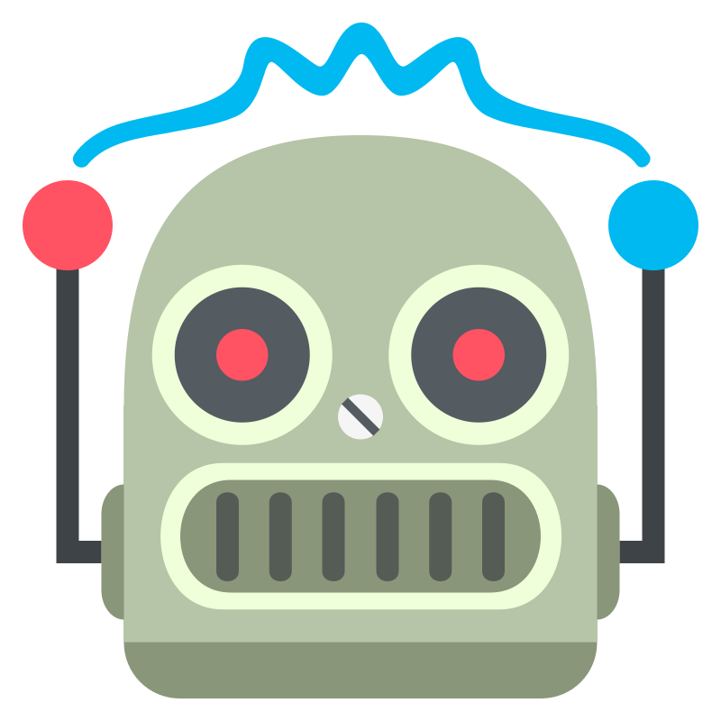

<p align="center">
  <a href="https://appoly.co.uk"></a>
  &nbsp;&nbsp;&nbsp;
  
</p>

# Multi-Agent Chat

An Electron app that enables multiple AI agents (Claude, Codex, etc.) to collaborate on challenges through a shared chat interface.

Uses your local installations of AI agents via command line. Bring your own API keys and configurations.

## Installation

```bash
npm i -g @appoly/multiagent-chat
```

## Usage

Run in your project directory:

```bash
multiagent-chat
```

### Advanced

```bash
# Specify workspace explicitly
multiagent-chat /path/to/project
multiagent-chat --workspace /path/to/project

# With custom config file
multiagent-chat --config /path/to/config.yaml

# Environment variables also work
WORKSPACE=/path/to/project multiagent-chat
```

## Configuration

On first run, a default config is created at `~/.multiagent-chat/config.yaml`.

```yaml
agents:
  - name: "Claude"
    command: "claude"
    args: ['--dangerously-skip-permissions']
    use_pty: true

  - name: "Codex"
    command: "codex"
    args: []
    use_pty: true
```

You can override with a project-local config using `--config /path/to/config.yaml`.

### Config Location

- **Global config**: `~/.multiagent-chat/config.yaml`
- **Recent workspaces**: `~/.multiagent-chat/recent-workspaces.json`

## How It Works

1. Select a workspace (project directory) or use current directory
2. Enter a challenge/topic for agents to discuss
3. Agents communicate via outbox files (messages delivered to their PTY)
4. Watch live collaboration in the chat panel
5. Final agreed plan written to `PLAN_FINAL.md` in the workspace
6. Optionally execute the plan -- other agents will review the implementation

## Requirements

- **Node.js**: v18.x - v22.x (Node 23+ not yet supported due to native module compatibility)
- **AI CLI tools**: Claude Code, Codex, or other compatible agents installed separately

## Troubleshooting

### Native Module Errors

If you encounter errors with native modules (node-pty), try rebuilding:

```bash
cd $(npm root -g)/@appoly/multiagent-chat
npx @electron/rebuild
```

### Node Version Issues

This package requires Node.js 18-22. If you're on Node 23+, use nvm to switch:

```bash
nvm use 20
npm i -g @appoly/multiagent-chat
```

## Contributing

```bash
git clone https://github.com/appoly/multiagent-chat.git
cd multiagent-chat
npm install
npm start
```

## License

MIT
